# DIY Sim Racing Button Box

I have some issues while marking up a switch holes and wire soldering so i decided to share my templates and "how to" guide.

Original credits goes to [AMSTUDIO](https://github.com/AM-STUDIO/32-FUNCTION-BUTTON-BOX) and [Opensimhardware](https://opensimhardware.wordpress.com/diy-arduino-buttonbox-version-1-eng/).

  
Table of Contents

  <ol>
    <li><a href="#layout-template">Layout Template</a></li>
    <li><a href="#wiring-diagram">Wiring Diagram</a></li>
    <li><a href="#components">Components</a></li>
    <li><a href="#software-setup">Software Setup</a></li>
  </ol>

## Layout Template

[Download vector template](/buttonbox_layout.ai)

Utilize it for drilling holes for buttons and switches. It has real sizes for all components listed below, just print it and put it over your plastic case 200 x 120 mm.
Use inside circles diameters. You should have drill bits sized 6, 7, 12, 14, 16 mm.

## Wiring Diagram

[Download drawio diagram](/buttonbox_wiring.drawio)

It's another side of the box cover that's why all buttons are mirrored.
You can open the source file in [diagrams.net](https://app.diagrams.net) editor.

## Components
Here's what I used for building button box.
Overall cost US $34.4 (2629 Rub).

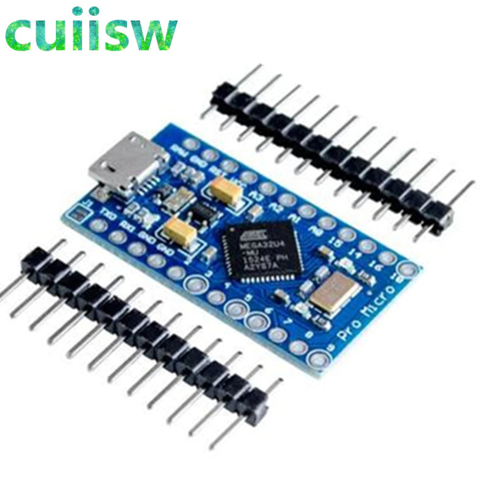 
[Arduino Pro Micro ATmega32U4 5V 16MHz](https://www.aliexpress.com/item/Pro-Micro-ATmega32U4-5V-16MHz-Replace-ATmega328-For-Arduino-Pro-Mini-With-2-Row-Pin-Header/32808519179.html?spm=a2g0s.12269583.0.0.323843e2ONxze9)
US $4.18 (319 Rub)

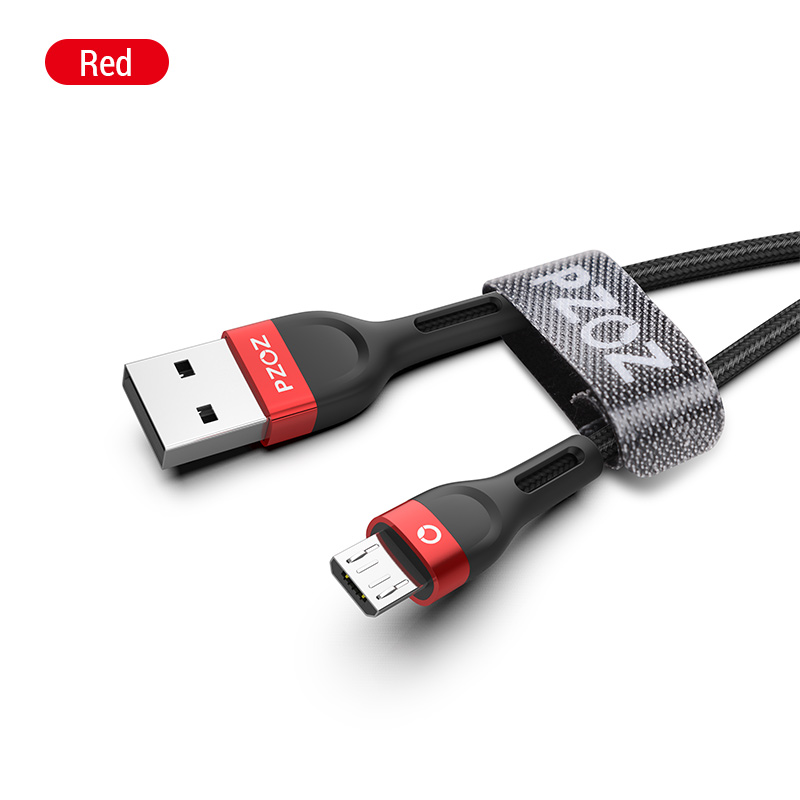 
[PZOZ Micro USB Cable (2 m)](https://www.aliexpress.com/item/PZOZ-Micro-USB-Cable-Fast-Charging-3A-Microusb-Cord-For-Samsung-S7-Xiaomi-Redmi-Note-5/32958208619.html?spm=a2g0s.12269583.0.0.637e29ea8RBpoD)
US $1.87 (143 Rub)

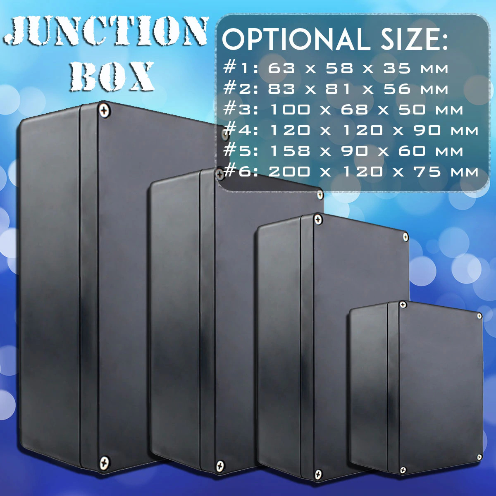 
[Waterproof Black Electronic Case (200 x 120 x 75 mm)](https://www.aliexpress.com/item/Waterproof-Black-DIY-Housing-Instrument-Case-ABS-Plastic-Project-Box-Storage-Case-Enclosure-Boxes-Electronic-Supplies/4000927393062.html?spm=a2g0s.12269583.0.0.334857c2cJOFWx)
US $8.99 (688 Rub)

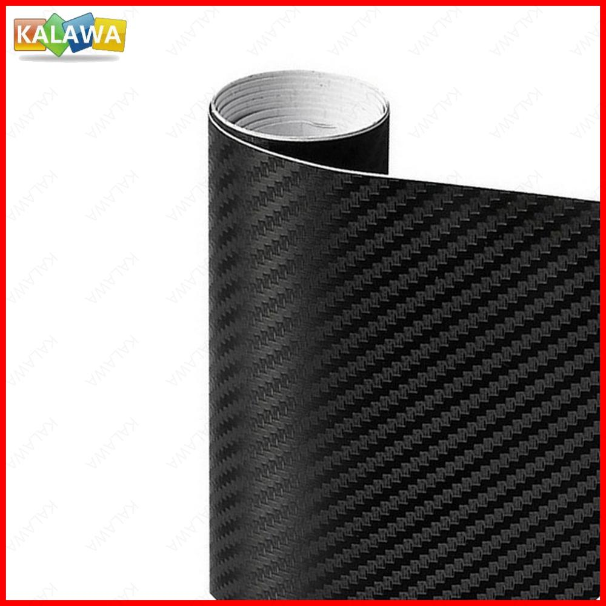 
[3D Carbon Fiber Vinyl Black (30 x 127 cm)](https://www.aliexpress.com/item/3D-Carbon-Fiber-Vinyl-Multiple-Size-Car-Wrap-Sheet-Roll-Film-Sticker-Motorcycle-Automobile-Styling-Black/4001133895921.html?spm=a2g0s.12269583.0.0.7e1b4a41BKBwUR)
US $3.69 (284 Rub)

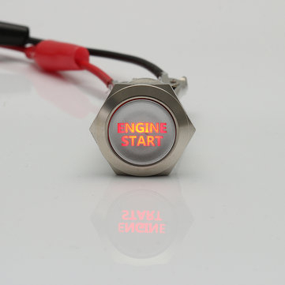 
[Reset (Momentary) Round Engine Start Metal Push Button(16mm Red)](https://www.aliexpress.com/item/5-Colors-DIY-16-19-22mm-Latching-Reset-Flat-Round-Engine-Start-Symbol-Text-12V-Led/4001340240615.html?spm=a2g0s.12269583.0.0.7f275277R46hTz)
US $3.32 (253 Rub)

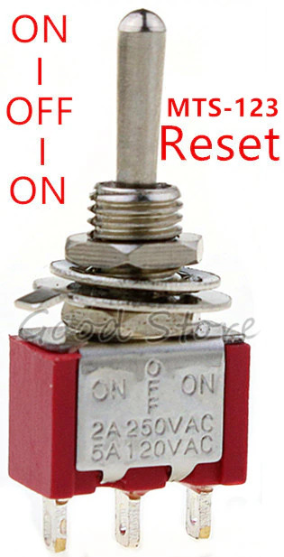 
[Miniature Toggle Momentary (on-off-on) Switches (MTS-123 Reset) x 5 Pcs](https://www.aliexpress.com/item/5pcs-10pcs-Red-Momentary-lock-Mini-MTS-123-MTS-103-3-Pin-SPDT-ON-OFF-ON/32951224970.html?spm=a2g0s.12269583.0.0.1a1528b5t8QDqh)
US $1.87 (143 Rub)

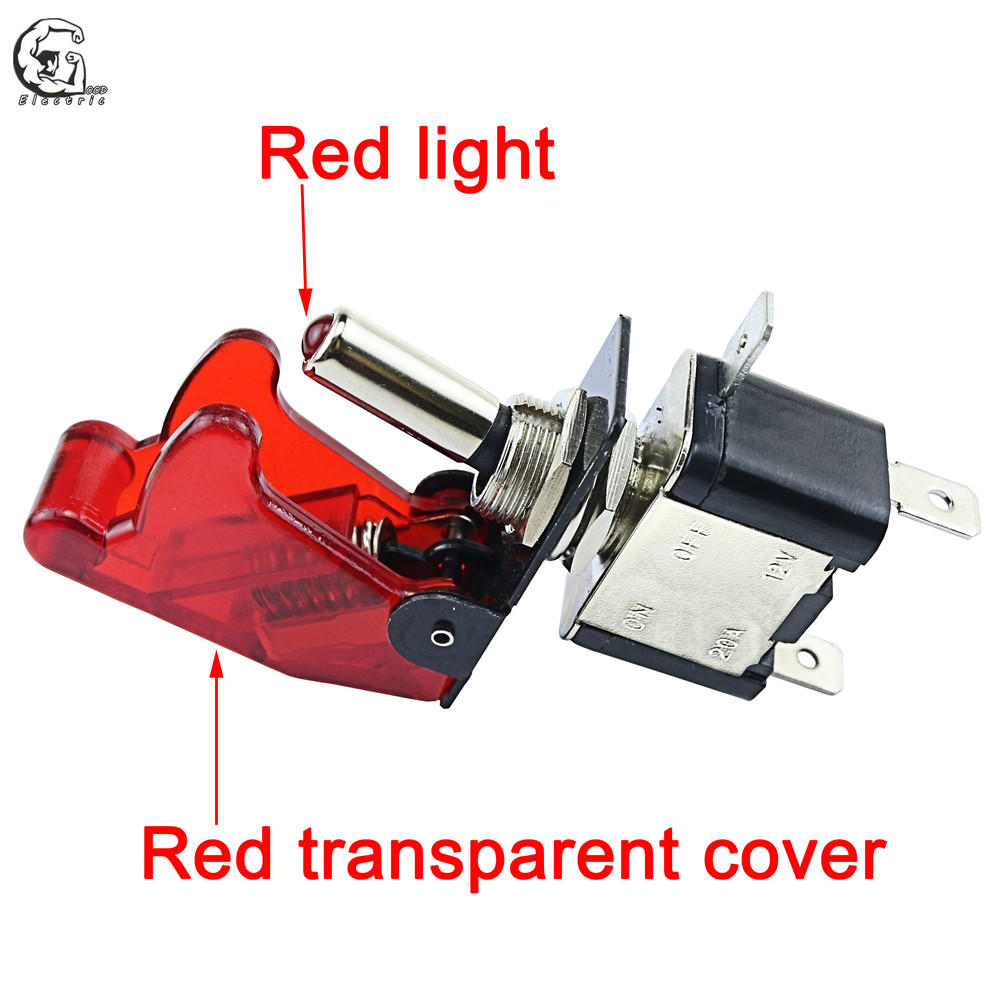 
[Toggle Switch Illuminated Led Red (ASW-07D)](https://www.aliexpress.com/item/Auto-Car-Boat-Truck-Illuminated-Led-Toggle-Switch-With-Safety-Aircraft-Flip-Up-Cover-Guard-Red/32859201158.html?spm=a2g0s.12269583.0.0.3e876f24BMhnUB)
US $1.69 (129 Rub)

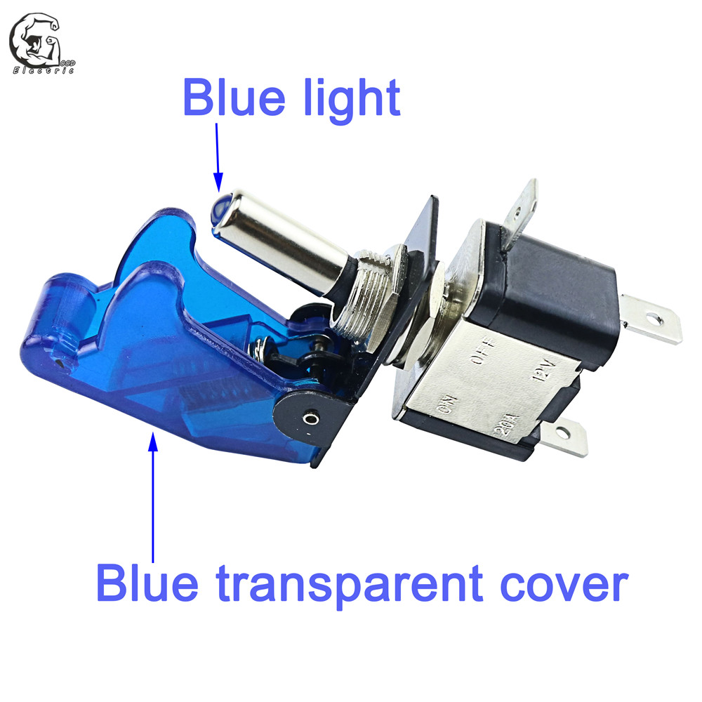 
[Toggle Switch Illuminated Led Blue (ASW-07D)](https://www.aliexpress.com/item/Auto-Car-Boat-Truck-Illuminated-Led-Toggle-Switch-With-Safety-Aircraft-Flip-Up-Cover-Guard-Red/32859201158.html?spm=a2g0s.12269583.0.0.68a86f24Iu2UTM)
US $1.69 (129 Rub)

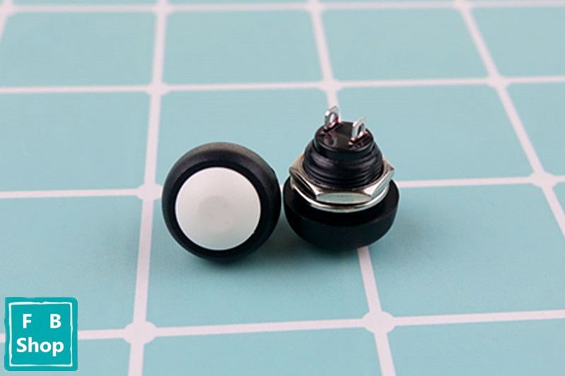 
[Momentary (Reset) Push Button White (PBS-33B) x 10 Pcs](https://www.aliexpress.com/item/10Pcs-PBS-33b-Black-Red-Green-Yellow-Blue-12mm-Waterproof-Momentary-Push-button-Switch/32860925831.html?spm=a2g0s.12269583.0.0.3e3ec93eDMLt54)
US $1.68 (128 Rub)

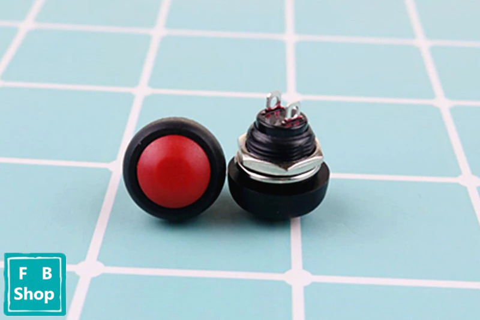 
[Momentary (Reset) Push Button Red (PBS-33B) x 10 Pcs](https://www.aliexpress.com/item/10Pcs-PBS-33b-Black-Red-Green-Yellow-Blue-12mm-Waterproof-Momentary-Push-button-Switch/32860925831.html?spm=a2g0s.12269583.0.0.3c98c93erXBaCq)
US $1.68 (128 Rub)

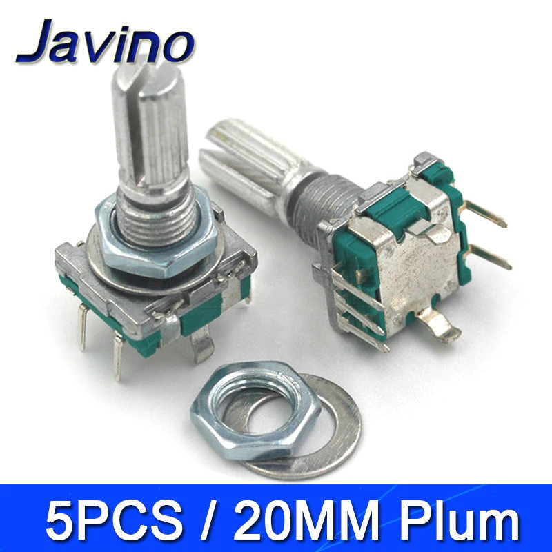 
[Rotary Encoder EC11 w Push Button 20mm Plum handle x 5 Pcs](https://www.aliexpress.com/item/5PCS-LOT-20-Position-360-Degree-Rotary-Encoder-EC11-w-Push-Button-5Pin-Handle-Long-15/10000056483250.html?spm=a2g0s.12269583.0.0.1cdd7334DBpJTm)
US $1.97 (150 Rub)

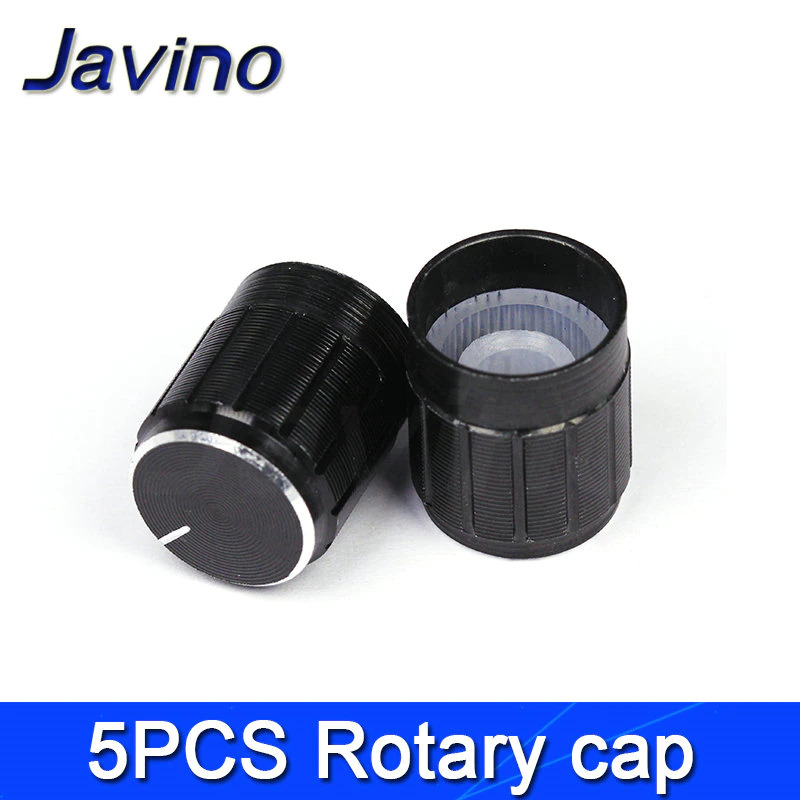 
[Rotary Caps Black x 5 Pcs](https://www.aliexpress.com/item/5PCS-LOT-20-Position-360-Degree-Rotary-Encoder-EC11-w-Push-Button-5Pin-Handle-Long-15/10000056483250.html?spm=a2g0s.12269583.0.0.1f2a7334KVtcHL)
US $0.63 (48 Rub)

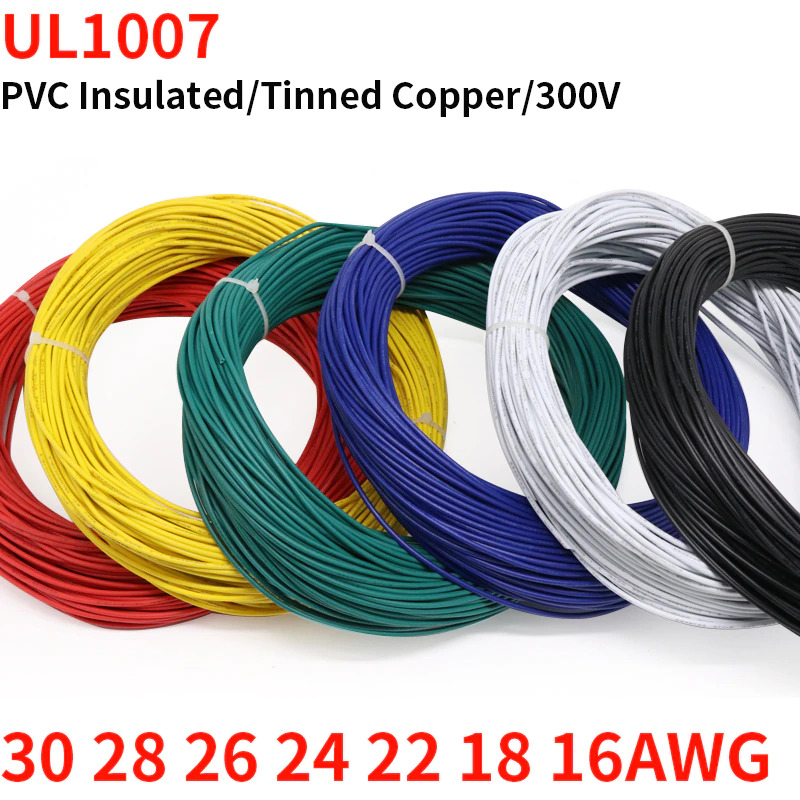 
[PVC Tinned Copper Wire Cable Black (30 AWG) 2m](https://www.aliexpress.com/item/2M-UL1007-PVC-Tinned-Copper-Wire-Cable-16-18-20-22-24-26-28-30-AWG/1005001657149453.html?spm=a2g0s.12269583.0.0.2c31205b1yiOka)
US $0.38 (29 Rub) 
[PVC Tinned Copper Wire Cable Red (30 AWG) 2m](https://www.aliexpress.com/item/2M-UL1007-PVC-Tinned-Copper-Wire-Cable-16-18-20-22-24-26-28-30-AWG/1005001657149453.html?spm=a2g0s.12269583.0.0.5098205bUb3MU6)
US $0.38 (29 Rub) 
[PVC Tinned Copper Wire Cable White (30 AWG) 2m](https://www.aliexpress.com/item/2M-UL1007-PVC-Tinned-Copper-Wire-Cable-16-18-20-22-24-26-28-30-AWG/1005001657149453.html?spm=a2g0s.12269583.0.0.388a205bQUUxiJ)
US $0.38 (29 Rub)

## Software Setup
Ten simple steps any of you can done without special programming skills.

1. Download and install [Arduino IDE](https://www.arduino.cc/en/software).
2. Download [ArduinoJoystickLibrary](https://github.com/MHeironimus/ArduinoJoystickLibrary/archive/master.zip).
3. In the Arduino IDE, select `Sketch` > `Include Library` > `Add .ZIP Library...`.  Browse to where the downloaded ZIP file is located and click `Open`. The Joystick library's examples will now appear under `File` > `Examples` > `Joystick`.
4. Get [32-FUNCTION-BUTTON-BOX](https://github.com/AM-STUDIO/32-FUNCTION-BUTTON-BOX) sketch file.
5. Open Arduino IDE and add `Keypad.h` library by clicking `Sketch` > `Include Library` > `Manage Libraries...` > Search for `Keypad` and install the one that is created by `Mark Stanley and Alexander Brevig`).
6. Connect your Arduino board to your computer by plugging in the USB cable.
7. To upload the code select the Arduino type by going to `Tools` > `Board:...` > `Arduino Leonardo`.
8. To select the correct USB port go to `Tools` > `Port:` > `COMx (Arduino Leonardo)`.
9. Verify the sketch by clicking on the `✓` in the top left corner (under File).
10. Press the `→` next to it to upload it to the Arduino.
